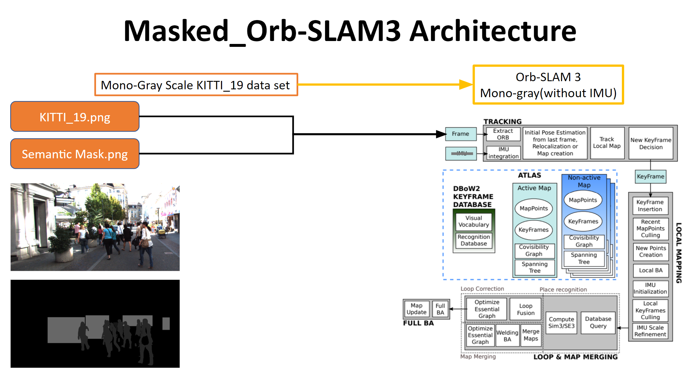

# Masked ORB-SLAM3

## Project Overview

This is <strong>Team 6</strong>'s final project git repository for <a href="https://robots.engin.umich.edu/mobilerobotics/">EECS 568: Mobile Robotics course</a> at <a href="https://robotics.umich.edu/">University of Michigan</a>. The title of our project is <strong>Masked ORB-SLAM3: Dynamic Element Exclusion for Autonomous Driving Scenarios Using Masked R-CNN for Increased Localization Accuracy.</strong>

The masked ORB-SLAM3 dynamic object localization pipeline architecture involves using <a href="https://gitlab.eecs.umich.edu/v_slam/orb-slam_dynamic/-/tree/main/kitti_sequence_masks">Mask generated</a> from masked R-CNN for <a href="http://www.cvlibs.net/datasets/kitti/eval_mots.php">a chosen dynamic on-road driving </a> as opposed to the typical usage of semantic masks in ORB-SLAM for localization.

 

## Getting Started

First, we recommend you read through our paper uploaded on this repository/docs. Next, read the two directly related works: [ORB-SLAM3](https://github.com/UZ-SLAMLab/ORB_SLAM3?msclkid=d3a88f5eb81f11ec968f0535c7080186) and [DynaSLAM](https://github.com/BertaBescos/DynaSLAM?msclkid=fe9695b7b81f11ec9d82fc4c92af772c)..

  

## Masked ORB-SLAM3 Architecture

Thus, based off the obvious inaccuracy in semantic masks for the ORB-SLAM, we propose the following architecture for our <strong>"Masked ORB-SLAM3 pipeline</strong>":

 

 

The visualization of masks used for our framework can be seen below: 

<!-- -->

A visualization of our implementation can finally be seen below:

 

## Installation and Running

To observe and remove the impact of dynamic objects in ORB-SLAM3 we selected one of the most dynamic datasets from the KITTI datasets. We observed that the ORB-SLAM 3 performs better if the dynamic content from the image frames is removed. We remove dynamic objects from the images by performing instance segmentation and then passing binary masks into the ORB-SLAM3 pipeline. We then use these masks to remove tracking points that overlap with our masks.

 

<h3><u>Running the Docker Image</u></h3>

This docker is based on ros melodic ubuntu 18.

There are two versions available:
- CPU based (Xorg Nouveau display)
- Nvidia Cuda based. 

To check if you are running the nvidia driver, simply run `nvidia-smi` and see if get anything.

Based on which graphic driver you are running, you should choose the proper docker. For cuda version, you need to have [nvidia-docker setup](https://docs.nvidia.com/datacenter/cloud-native/container-toolkit/install-guide.html) on your machine.

 

<h3><u>Compilation and Running</u></h3>

Steps to compile the Orbslam3 on the sample dataset:

- `./download_dataset_sample.sh`
- `build_container_cpu.sh` or `build_container_cuda.sh` depending on your machine.

Now you should see ORB_SLAM3 is compiling. 
To run a test example:
- `docker exec -it orbslam3 bash`
- `cd /ORB_SLAM3/Examples&&./euroc_examples.sh`

You can use vscode remote development (recommended) or sublime to change codes.
- `docker exec -it orbslam3 bash`
- `subl /ORB_SLAM3`

 

<h3><u>Running Our Implementation</u></h3>

Once the container can run the sample data from the instructions, you may add your own data (for example from the KITTI dataset) into the Datasets folder with the same hierarchy. To use our masked implementation, clone our repository and run the `build.sh` command. Then run `mono_kitti` (looking at `euroc_examples.sh` can show examples of how the original implementation is run) with an additional command line argument appended at the end containing the directory of the segmentation masks. If you are using WSL make sure you are running an x-server so you can see the GUI.

---

## Project Team and Workload Distribution

Our team members are: 

 - [**Aditya Om**](https://www.linkedin.com/in/adityaom/)

 - [**Aman Kushwaha**](https://www.linkedin.com/in/raghav-varshney/)

- [**Kyle Liebler**](https://www.linkedin.com/in/lieblius/)
- [**Ping-Hua Lin**](https://www.linkedin.com/in/michaelphlin/) 
- [**Zhuowen Shen**](https://www.linkedin.com/in/zhuowenshen7558/)

We had divided the work responsibility amongst ourselves in the following manner: 

| S. No. | Work Item                 | Done By           |
|--------|---------------------------|-------------------|
| 1.     | KITTI Run in ORB-SLAM      | All               |
| 2.     | Choosing right data (KITTI / semantic data set) | All               |
| 3.     | GT Semantic + Mask GT data + ORB-SLAM | Kyle, Ping-Hua, Zhuowen |
| 4.     | Mask-RCNN+ Mask RCNN data + ORB-SLAM | Kyle, Aditya, Aman |
| 5.     | Bench-marking research & Comparison | Aditya, Ping-Hua |
| 6.     | Documentation | All |
| 7.     | Project website and Git | Kyle, Aditya |

 

---

## Acknowledgments

We express our sincere thanks to our EECS 568 instructor <a href="https://robotics.umich.edu/profile/maani-ghaffari/">Prof. Maani Ghaffari Jadidi</a> for his guidance, as well as the GSIs <a href = "https://tzuyuan.github.io/">Tzu-Yuan (Justin) Lin</a> and <a href = "https://www.linkedin.com/in/jingyu-song-93763a132/?originalSubdomain=cn">Jingyu (JY) Song</a> for all the support they provided this semester. The link to our course website can be found [here](http://robots.engin.umich.edu/mobilerobotics/).

We would like to also acknowledge our profound gratitude towards Carlos Campos, Richard Elvira, Juan J. Gómez Rodríguez, José M. M. Montiel, Juan D. Tardos., for their seminal work in <a href="https://gitlab.eecs.umich.edu/v_slam/papers/-/blob/main/ORB-SLAM3.pdf">ORB-SLAM3</a>, as well as Berta Bescos, José M. Fácil, Javier Civera and José Neira for their work in <a href="">DynaSLAM.</a> 

---

## References
The papers that we have referred for ideation, pipeline architecture and bench-marking of results against already existing localization results <a href = "https://gitlab.eecs.umich.edu/v_slam/papers">can be found here.</a>
